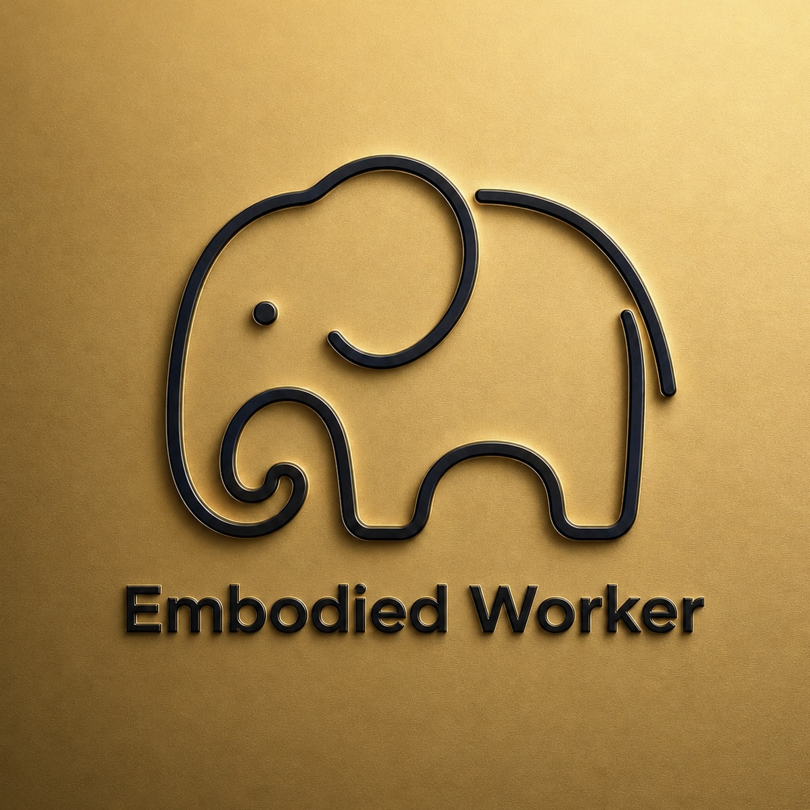

  

# EW Embodied Knowledge Forge / 具象知識鍛造器

Turn ChatGPT conversations and documents into a standard Obsidian Vault ZIP. Download, unzip, and open the folder as a Vault—no Obsidian community plugin or separate API key is required.

把 ChatGPT 對話與文件整理成標準 Obsidian Vault ZIP。下載、解壓縮，再將資料夾作為 Vault 開啟即可；不需要安裝 Obsidian 外掛，也不需要另外申請 API 金鑰。

## English

### Default workflow in v0.3.0

1. Finish a discussion or provide source documents in ChatGPT.
2. Use EW Knowledge Forge to extract durable concepts, decisions, requirements, evidence, processes, and relationships.
3. Download the generated `.zip` file.
4. Extract it first; do not try to open the ZIP itself in Obsidian.
5. In Obsidian, choose **Open folder as vault** and select the extracted top-level folder.
6. Open `README-START-HERE.md` or the hub note, then use Graph view to explore the links.

Every generated ZIP must contain one Vault folder, linked Markdown notes, a hub note, and English plus Traditional Chinese usage guides.

### iPhone and iPad

1. Download the ZIP.
2. Open Apple's Files app and tap the ZIP once to extract it.
3. Move the extracted folder to `On My iPhone/Obsidian` or `iCloud Drive/Obsidian`.
4. Open Obsidian, choose **Open folder as vault**, and select that folder.

### Windows and macOS

1. Download and extract the ZIP.
2. Open Obsidian and choose **Open folder as vault**.
3. Select the extracted Vault folder.

## 中文

### v0.3.0 預設流程

1. 在 ChatGPT 完成討論，或提供需要整理的來源文件。
2. 使用「具象知識鍛造器」提取可長期使用的概念、決策、需求、證據、流程與關聯。
3. 下載系統生成的 `.zip`。
4. 必須先解壓縮；不要直接在 Obsidian 開啟 ZIP。
5. 在 Obsidian 選擇「將資料夾作為 Vault 開啟」，再選擇解壓後的最上層資料夾。
6. 先閱讀 `使用說明-請先閱讀.md` 或知識首頁，再開啟關係圖譜。

每個 ZIP 都必須包含：單一 Vault 資料夾、相互連結的 Markdown、知識首頁，以及中英文使用說明。

### iPhone／iPad

1. 下載 ZIP。
2. 打開 Apple「檔案」App，點一下 ZIP 進行解壓縮。
3. 將解壓後的資料夾移到「我的 iPhone／Obsidian」或「iCloud Drive／Obsidian」。
4. 開啟 Obsidian，選擇「將資料夾作為 Vault 開啟」，再選取該資料夾。

### Windows／macOS

1. 下載並解壓縮 ZIP。
2. 開啟 Obsidian，選擇「Open folder as vault」。
3. 選擇解壓後的 Vault 資料夾。

## Responsibilities / 分工

| Stage | ChatGPT knowledge forging | Obsidian |
| --- | --- | --- |
| Purpose | Extract, classify, link, version, and validate knowledge | Store and display local Markdown and graph links |
| Output/input | Produces a standard Vault ZIP | Opens the extracted Vault folder |
| Additional plugin | Not required | Not required |
| API key | No separate key | None |

ChatGPT is the knowledge forge; Obsidian is the local knowledge repository and graph.

ChatGPT 是知識鍛造場；Obsidian 是使用者本機的知識倉庫與知識圖譜。

## Safety

- Generated ZIPs never include `.obsidian`, credentials, or executable payloads.
- The graph is validated for required metadata and broken wikilinks before packaging.
- ChatGPT never claims that a generated ZIP has already been imported into the user's Vault.
- ZIP import into an existing Vault is manual; automatic backup and conflict-safe merging are not claimed.

## Repository layout / 專案結構

- `plugins/ew-obsidian-knowledge-forge/` — ChatGPT/Codex plugin
- `skills/obsidian-knowledge-forge/scripts/build_vault_zip.py` — standard Vault ZIP builder
- `skills/obsidian-knowledge-forge/assets/` — note templates and bilingual ZIP guides
- `src/main.js` — legacy/experimental `.ewforge` importer retained for compatibility
- `submission/` — public listing and review materials

## Trademark / 商標

The Embodied Worker name, elephant mark, and supplied artwork are trademarks or proprietary brand assets of Embodied Worker Co., Ltd. Their inclusion does not grant reuse rights.

Embodied Worker 名稱、金色大象圖樣及提供的商標素材，均為具象職人股份有限公司的商標或專有品牌資產；收錄於本專案不代表授權第三方使用。

